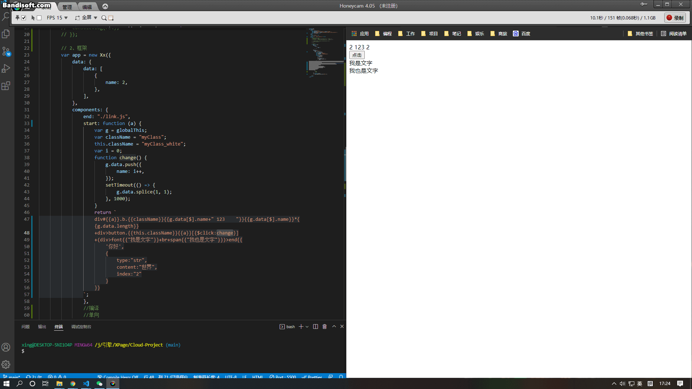

# Xx-Project

## 一个开源的框架



---

### 1、实现 require.js 并加入链式引入机制

- 模块引入遵循 commonJS 规范，如 filmeName 模块内容为

  ```js
  module.exports = "内容";
  ```

  外部引入时：

  ```js
  var path = x.$path.join(location.href, "../../fileName.js");
  x.$require(path).then(function (ret) {
  	console.log(ret); //打印 “内容”
  });
  ```

- 当引入模块中还引入其他模块时，父线程会等待所有模块加载完毕后继续执行

  如 load.js 模块内容为：

  ```js
  this.x.$require("./a.js").then(function () {
  	module.exports = "内容a";
  });
  ```

  <font color="red">注意，在模块中引入其他模块时请使用 this.x.$require 方法,this 指向当前模块全局对象，模块路径为当前模块的相对路径，如当前模块绝对路径为/first/second/a.js，被引入模块路径为 ./b.js ,则被引入的模块绝对路径为/first/second/b.js</font>

  外部引入时：

  ```js
  var path = x.$path.join(location.href, "./load.js");
  x.$require(path).then(function (ret) {
  	console.log(ret); //打印 “内容a”
  });
  ```

- require 方法支持引入多个模块

  ```js
  x.$require("./a.js", "b.js", "c.js").then(function (ret) {
  	console.log(ret);
  });
  ```

- 共享作用域（遵循 commonJS）

  当重复引入同一个模块时，该模块不会重复加载资源文件，且作用域内变量全局共享

  ```js
  x.$require("./a.js", "b.js", "c.js").then(function (ret) {
  	console.log(ret);
  });
  ```

### 2、框架结合了 vscode 的代码自动补全和单向绑定机制

- 运行过程：实例化 Xx 对象可以在回调函数中获取到 vm 对象，vm 对象用于将组件转化为 dom 树，并由开发人员在当前文档流中操作。

- 语法：

  ```js
  var app = new Xx({
  	data: {
  		data: [
  			{
  				name: 2,
  			},
  		],
  	},
  	components: {
  		end: "./link.js",
  		start: function () {
  			var g = globalThis;
  			var className = "myClass";
  			this.className = "myClass_white";
  			var i = 0;
  			function change() {
  				g.data.push({
  					name: i++,
  				});
  				setTimeout(() => {
  					g.data.splice(1, 1);
  				}, 1000);
  			}
  			return `
  					div#a.b.{{className}}{{g.data[$].name+" 123    "}}{{g.data[$].name}}*{{g.data.length}}
  					+div>button.{{this.className}}{{"点击我"}}[{$click:change}]
  					+(div>font{{"我是文字"}}+br+span{{"我也是文字"}})>end{{
  						'你好',
  						{
  							type:"str",
  							content:"世界",
  							index:"2"
  						}
  					}}
  				`;
  		},
  	},
  	run: function (vm) {
  		demo.appendChild(vm.start());
  	},
  });
  ```

  #### 每一个组件方法都要返回一个字符串，字符串语法类似 vscode 的自动补全

  - {{}}

    > 双大括号内包含当前组件或者 dom 元素的文本值或参数

    如 span{{"我也是文字"}} 会生成一个 span 标签，标签内容是"我也是文字"

    如果将要生成的标签名与当前组件重名则会将当前标签视为一个组件，并将{{}}内的值视为组件参数，参数由逗号 “,“ 隔开

    如：

    ```js
    end{{
    	'你好',
    	{
    		type:"str",
    		content:"世界",
    		index:"2"
    	}
    }}
    ```

  - \>

    > \>符号表示标签的下一级，如 div>div 表示 div 包含一个 div

  - \+

    > \+符号表示标签的同级，如 div+div 表示两个 div 相邻，且在同一个父级元素节点下

  - ()

    > () 括号符号表示一个 template 模板区域，()后接的\>、\+ 符号以()内的第一个元素为基准

  - [{}]

    > [{}]内书写标签属性 [{attrName:"属性值"}] ，事件则需要以$event形式书写，如[{$click:change}]

  - - > \* 代表标签、组件、模板区域的重复次数，且在对应标签中可以通过\$符号获取当前标签的 index,如 div{{$}}\*3,则会获得重复三次的 div，div 的文本内容分别为 1,2,3

  - \#和\.
    > \#和\.符号分别用于标志元素的 id 和 class 的值，其中 id 只能标志一个，class 可以通过\.符号标志多个

- 组件运行

  组件内部有一个全局对象 globalThis,globalThis 指向 Xx 对象实例化时的 data 参数

  组件内部有组件对象 this,this 指向组件内部的数据对象，所有组件必须初始化 this，且保证 this 中包含所有会用到的属性

  this 和 globalThis 的数据单向绑定到构造的 dom 中
